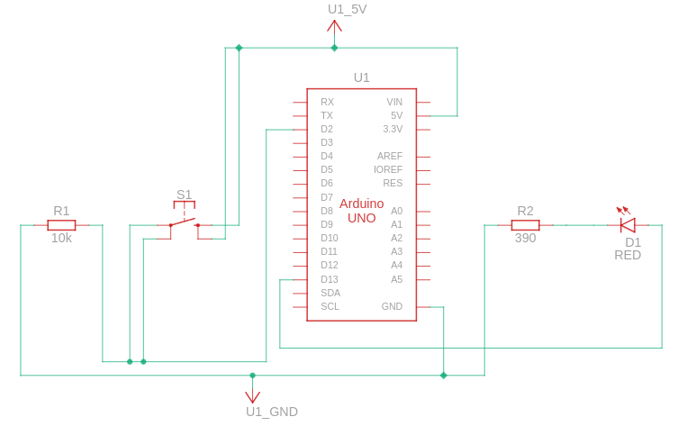
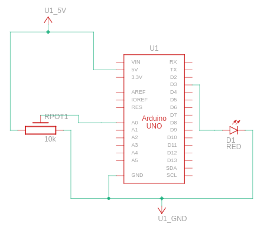

# Sistemas Embarcados - Contato Inicial

Utilize o kit com Arduino entregue a você para implementar dois programas com as seguintes especificações. A documentação e o código fonte de cada solução devem estar em diretórios separados.

## Programa 1 - Interruptor LED

1. Monte um circuito com um Arduino, um LED e um botão.

2. Implemente o software de uma aplicação que utilize o botão para acender e apagar o LED. O botão funciona como interruptor, ou seja, cada vez que o botão for pressionado, o estado do LED se alterna entre ligado e desligado.

3. O código-fonte e a documentação do seu trabalho devem estar no GitHub. A documentação deve estar no arquivo README.md do diretório da aplicação, e deve incluir o esquema elétrico utilizado.

## Documentação

Para este circuito, foram utilizados os seguintes componentes:

* Um botão (entrada).
* Um LED (saída).
* Um resistor de 390 Ω conectado ao LED.
* Um resistor de 10 KΩ onectado ao botão.

Quanto ao código, implementou-se um programa com 4 máquinas de estado.

* OFF: Estado onde o LED se encontra apagado.
* W1: Estado de transição entre OFF e ON.
* ON: Estado onde o LED se encontra aceso.
* W2: Estado de transição entre ON e OFF.

## Programa 2 - Voltímetro e Dimmer Digital

1. Monte um circuito com um Arduino, um LED e um potenciômetro de 10kohm.

2. Implemente o software de uma aplicação que, a cada segundo, leia o valor do conversor analógico-digital conectado à saída do potenciômetro, imprima o resultado da leitura em volts, use o valor lido para ajustar o brilho do LED, proporcionalmente.

3. O código-fonte e a documentação do seu trabalho devem estar no GitHub. A documentação deve estar no arquivo README.md do diretório da aplicação, e deve incluir o esquema elétrico utilizado.

## Documentação

Para o segundo circuito, foram utilizados os seguintes componentes:

* Um potenciômetrom de 10 KΩ (entrada).
* Um LED (saída).

Quanto ao programa, modificou-se a função _map()_ para que ela retorasse o valor do led, na forma decimal. O que proporcionou um aumento na precisão da leitura.