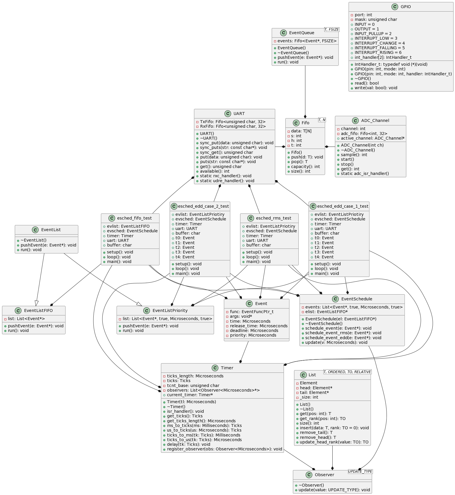

[](https://classroom.github.com/a/He3J_i_X)

# Biblioteca LIBAVR para Sistemas Embarcados

Esta é uma biblioteca destinada a programação de sistemas embarcados utilizando o microcontrolador ATmega328P. Ela foi desenvolvida com objetivo proporcionar um conjunto de módulos que incluem UART (Transmissor/Receptor Assíncrono Universal), ADC (Conversor Analógico-Digital) e GPIO (Portas de Entrada/Saída de Propósito Geral) para facilitar o desenvolvimento de projetos embarcados.

## UART

A UART é utilizada para a comunicação entre o microcontrolador (Arduino) e outros dispositivos, como o computador. Este módulo é composto por métodos síncronos para envio (sync_put) e recepção (sync_get) de dados pela UART, além de contar com métodos assíncronos, que são chamados através do tratador de recepção (rxc_handler) e transmissão (udre_handler).

# FIFO

O módulo FIFO fornece uma estrutura de fila de tamanho fixo para armazenar e gerenciar dados. A classe FIFO é um template que aceita dois tipos de dados: o tipo dos elementos que você deseja armazenar e o tamanho máximo da fila. Ele inclui funções para adicionar, remover, verificar o tamanho da fila e verificar a capacidade máxima da fila.

## ADC

O módulo ADC é responsável pela conversão de sinais analógicos em sinais digitais. Ele oferece métodos para obter o valor médio das últimas 32 medições armazenadas em uma fila. O módulo também suporta a definição de canais de conversão e trata interrupções quando a conversão é concluída.

## GPIO

Este módulo permite definir o estado de uma porta como entrada ou saída e trata interrupções quando um evento específico ocorre. As interrupções podem ser configuradas para detectar mudanças nos sinais de entrada, seja uma borda de subida ou descida.

## Timer

A classe `Timer` representa um temporizador nesta biblioteca. Seus atributos incluem informações sobre o comprimento de um tick, contagem de ticks, base de contagem de temporizador e uma lista de observadores. Com métodos para acessar e converter unidades de tempo, atrasar a execução e registrar observadores. O uso de um membro estático, `current_timer`, permite rastrear o temporizador atual no contexto do programa.

## Observer

A classe Observer é um template que define uma interface para observadores. Quem o herdar, deve implementar a função `update`, que é chamada para notificar o observador sobre uma atualização de valor. O parâmetro de template `UPDATE_TYPE` indica o tipo de dado que será passado para a função update. A classe possui um destrutor virtual para a liberação de recursos ao destruir objetos derivados.

## List

A classe `List` é uma implementação genérica de uma lista encadeada. Seus elementos são representados por uma estrutura interna que inclui dados (`data`), ponteiros para elementos anteriores (`prev`) e seguintes (`next`), e uma classificação opcional (`rank`). A lista mantém ponteiros para a cabeça (`head`) e a cauda (`tail`) e um contador de tamanho (`_size`). Oferece métodos para inserção ordenada ou no final, bem como remoção da cabeça ou cauda.

## Event

A estrutura `Event` define um tipo de dado que representa um evento com características específicas. Cada evento contém um ponteiro para função (`func`), que aponta para a função a ser executada quando o evento ocorre, um ponteiro para argumentos (`args`) que podem ser passados para a função, e dois campos de tempo em microssegundos: `release_time` representa o momento de liberação do evento, e `deadline` indica o prazo para a execução do evento.

## EventList

A classe abstrata `EventList` define uma interface para listas de eventos, com métodos virtuais para adicionar eventos à lista (`pushEvent`) e executar eventos (`run`). Duas subclasses concretas são implementadas: EventListPriority para uma lista de eventos prioritária ordenada, e EventListFIFO para uma lista no formato FIFO.

## EventSchedule

Ao herdar o `Observer` e utilizar uma lista ordenada, a classe gerencia eventos com base em prioridades temporais. O método `schedule_event` agenda eventos considerando seus tempos de liberação e prazo, enquanto o método `update` trata notificações de alterações no tempo.


## EventQueue

A classe `EventQueue` implementa uma fila de eventos com tamanho fixo, utilizando a classe genérica `Fifo`. Além disso, a classe oferece métodos para adicionar eventos (`push`) e executá-los em ordem de chegada (`run`). Por fim, o tamanho da fila é especificado como um parâmetro do modelo. 

## Compilação

### esched_edd_case_1_test

Para compilar este teste, basta entrar no arquivo [Makefile](./Makefile) e alterar a linha `APP` para:

```cpp
APP := esched_edd_case_1_test.cpp
```

### esched_edd_case_2_test

Para compilar este projeto, entre no arquivo [Makefile](./Makefile) e alterar a linha `APP` para:

```cpp
APP := esched_edd_case_2_test.cpp
```

### esched_fifo_test

Para compilar este projeto, entre no arquivo [Makefile](./Makefile) e alterar a linha `APP` para:

```cpp
APP := esched_fifo_test.cpp
```

### esched_rms_test

Para compilar este projeto, entre no arquivo [Makefile](./Makefile) e alterar a linha `APP` para:

```cpp
APP := esched_rms_test.cpp
```

Para rodar o projeto, basta digitar o seguinte comando no terminal:

```cpp
make all
```

Para remover os arquivos gerados, basta digitar:

```cpp
make clean
```

## Diagrama de Classes

