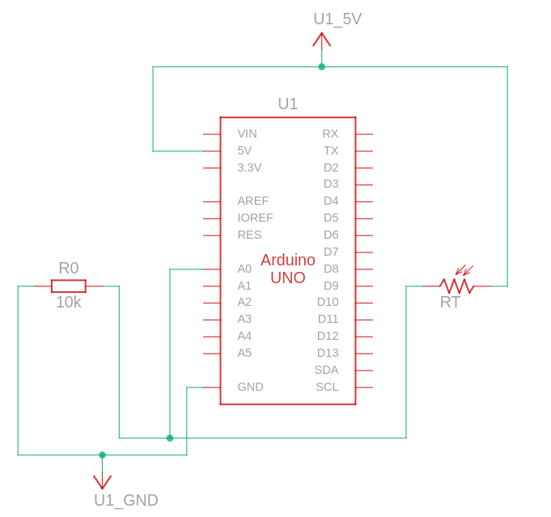
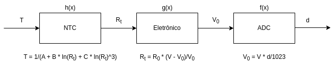

# IFSC - Sistemas Embarcados - Sensores

Nesta atividade você modelará, calibrará e implementará o software para ler temperatura a partir do termistor NTC. Ao final você deve entregar um relatório curto apresentando:
* O esquema elétrico do projeto (Arduino + NTC);
* O modelo (diagrama de blocos de atores e equações);
* Os parâmetros do modelo (obtenção dos coeficientes de [Steinhart-Hart](https://en.wikipedia.org/wiki/Steinhart%E2%80%93Hart_equation) para o seu sensor);
* Obtenção dos erros aleatório e sistemático;
* Uma curva de erro do sensor (resultado do seu modelo - resultado do sensor de referência).
Observação: O modelo do circuito elétrico foi realizado pelo professor durante as aulas, assim como a medição de alguns pontos da curva Resistência X Temperatura para cálculo dos parâmetros do modelo Steinhart-Hart.

# Documentação

## Link Direto

* [Esquema Elétrico](./esquematicos/Esquema_elétrico.png)
* [Diagrama de Blocos](./esquematicos/Modelo.png)
* [Cálculo dos Coeficientes de Steinhart-Hart](./codigos/Calculo_dos_coeficientes.m)
* [Temperaturas Medidas](./arquivos/dadosLucas.csv)
* [Temperaturas Modelo](./arquivos/dadosModelo.csv)
* [Cálculo e Curva de Erro](./codigos/calculoErro.ipynb)
* [Código Arduino](./codigos/temperatura.ino)

## Esquema Elétrico

Para este circuito, foram utilizados os seguintes componentes:

* Um termistor de 10 KΩ.
* Um resistor de 10 KΩ.

## Diagrama de Blocos

Uma vez que o autor possuia apenas os valores fornecidos pelo sensor (d), realizou-se um processo inverso para encontrar a temperatura (T).

Para isso, após a obtenção da resistência (Rt), [calculou-se](./codigos/Calculo_dos_coeficientes.m) os coeficientes A, B e C do método de Steinhart-Hart.

## Erros

Comparando as [temperaturas obtidas](./arquivos/dadosLucas.csv) em um determinado intervalo de tempo, com o [modelo de um colega](./arquivos/dadosModelo.csv), obteu-se o valor e a curva de erro, permitindo assim, realizar uma correção na leitura do NTC.

## Código Arduino

O objetivo deste [programa](./codigos/temperatura.ino) é obter a temperatura, a partir do dado fornecido pelo termistor.

Para facilitar o entendimento, o código foi dividido em funções, onde cada uma representa uma das etapas apresentadas no diagrama de blocos.